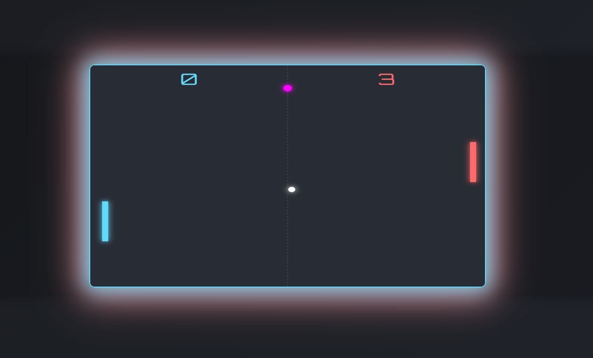

# 🕹️ Neon Pong Game

> **A modern, neon-styled Pong game you can play on any device!**

---

## 🎮 Features
- ⚡ **Smooth paddle controls** (keyboard, mouse, and touch)
- 🤖 **Challenging AI opponent**
- 🏆 **Score tracking & win detection**
- 📱 **Responsive & mobile-friendly**
- ✨ **Neon visual effects & animations**
- 🟢 **Power-ups and combos**
- 🔊 **Sound effects**

---

## 🚀 How to Play
- **Move your paddle:**
  - Keyboard: <kbd>W</kbd>/<kbd>S</kbd> or <kbd>↑</kbd>/<kbd>↓</kbd>
  - Mouse: Move the mouse up/down over the game
  - Touch: Use on-screen buttons on mobile
- **First to 10 points wins!**
- The ball speeds up after each paddle hit.

---

## 🛠️ Technologies Used
- HTML5 Canvas
- CSS3 (with glassmorphism & neon effects)
- Modern JavaScript (ES6+)

---

## 📷 Screenshots

<!-- To add your own screenshot:
1. Take a screenshot of your game running.
2. Save it as 'pong-screenshot.png' in an 'assets' folder in your project.
3. Commit and push the image to your repository.
-->

---

## 💡 Tips
- Try playing on your phone or tablet for a different experience!
- Challenge yourself by letting the AI win a few points and see how fast the ball gets!

---

## 👨‍💻 Author
- Made with ❤️ by md-safiulsadik